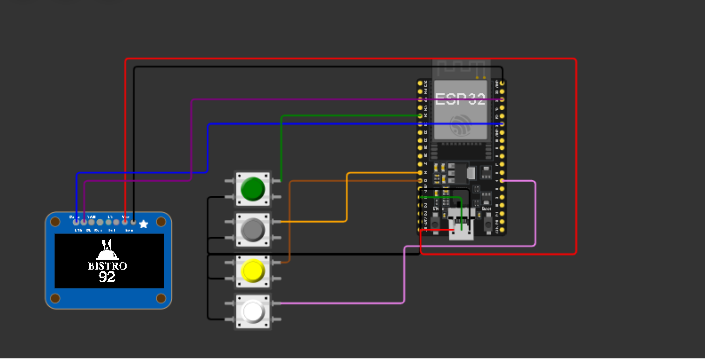
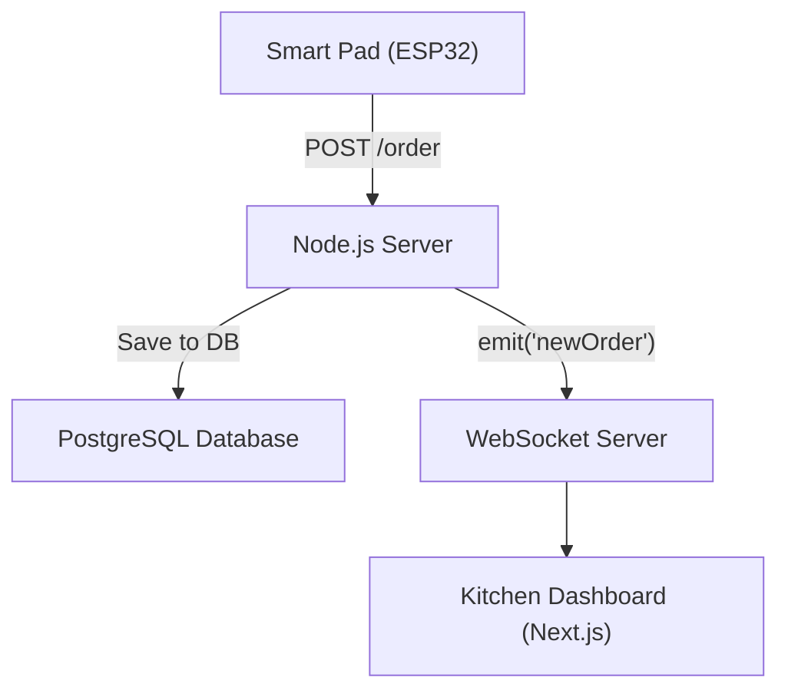
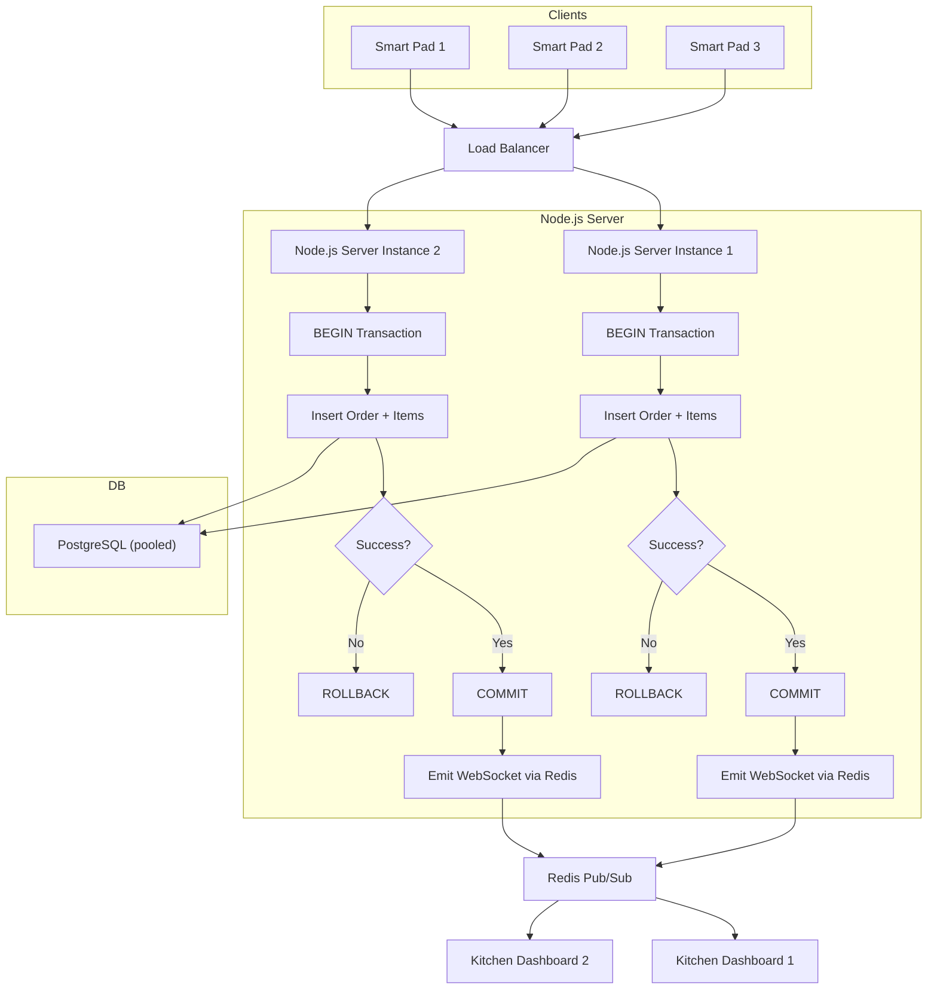

# Team-Shockwave-in-MIE-Robolution
This repository is for the MIE Robolution competition held on CUET. Team Shockwave documented the necessary required solutions and answers in this.
For explanation video click the <a href='https://drive.google.com/drive/folders/1AIb1R7rmQRJiN9U9rRb0OrYNWt-d7-ru?usp=drive_link'>here</a>
<br>
# A) Quick Fixes 
<br>

Q1) <b>Suggested features:</b>

*Must balance pace, accuracy, and be user-friendly.*

1. <b>Intuitive Menu Navigation:</b> Easy scrolling and selection using buttons for all users.
2. <b>Real-Time Order Updates:</b> Instant transmission to the kitchen via cloud.
3. <b>Order Confirmation:</b> Display confirmation on the device after order submission.



Q2) <b>Design principles:</b>


*Design must be user-friendly. Too much complex UI can lead to backlash from general consumers.*

1. <b>Button principle:</b> Minimal button presses (e.g., one button to open the menu, two to confirm) and Maintain the same level of consistency for similar actions, like using the same button for the same task.Example – Back always on Button 1.
2. <b>Display principle:</b> Visual cues on the OLED display (e.g., highlight selected item, show quantity). Giving feedback while task like add to cart or confirm order is completed.

Q3) <b> Potential security vulnerabilities</b> 

*Hackers or young customers might tamper or try exploiting the weak spots.*

1. <b>Theft of Device:</b> Secure devices to tables; use tamper-proof screws.
2. <b>Order Tampering:</b> Encrypt data transmission; use unique order IDs.
3. <b>Data Leaks:</b> Maintain a secure protocol like HTTPS for data transfer in the cloud.

Q4) <b>Strategies:</b>

*System lag can frustrate customers.* 

1. <b>Load Balancing:</b> Distribute cloud requests across 2 or more servers.
2. <b>Queue Management:</b> Buffer orders in a queue to prevent system overload.

Q5)  <b>Integrate the existing inventory system</b>

*Sudden system changes can create chaos in the kitchen.*

🔗 **Gradual Sync:**  
 API can be used to fetch and update stock data seamlessly. The API fetches inventory data by sending a GET request to the inventory management system's endpoint (e.g., /api/inventory), retrieving real-time stock levels for ingredients like tomatoes or pasta, which are then stored in a cloud database like Firebase. To update stock without interrupting kitchen operations, the API uses asynchronous POST requests (e.g., /api/inventory/update) triggered by each order, deducting used quantities (e.g., 2 tomatoes for a salad) from the database while the kitchen continues its workflow uninterrupted. This method ensures smooth operations, as the kitchen focuses on cooking while the system handles stock adjustments automatically.
```
 [Smart Pad Order] → [API: GET /inventory] → [Cloud DB: Fetch Stock]
                          ↓
[Order Processed] → [API: POST /update] → [Cloud DB: Update Stock]
                          ↓
[Kitchen Dashboard: View Updated Stock]
```


# B) werr

Q1)
The schema tracks users, tables, menu items, orders, and payments, optimized for performance with proper relationships and indexing:

admin_users: System managers (id, name, email, password)
tables: Physical restaurant tables (id, table_number, status)
menu_items: Menu data (id, name, price, category, is_available, etc.)
orders: Orders per table with timestamps (id, table_id, status, placed_at, total_amount)
order_items: Ordered items with quantity and price snapshot (order_id, menu_item_id, quantity)
payments: Payments by order (order_id, amount, method, status, paid_at)

Indexes on foreign keys and timestamps boost speed for frequent queries (e.g. recent orders, item lookups).

Q2)
To retrieve all orders from the past hour with table numbers, item names, and timestamps:

```sql
SELECT 
  o.id AS order_id,
  t.table_number,
  o.placed_at,
  mi.name AS item_name,
  oi.quantity
FROM orders o
JOIN tables t ON o.table_id = t.id
JOIN order_items oi ON oi.order_id = o.id
JOIN menu_items mi ON oi.menu_item_id = mi.id
WHERE o.placed_at >= NOW() - INTERVAL '1 hour'
ORDER BY o.placed_at DESC;
```

This query is optimized using indexes on `placed_at`, `table_id`, and `order_id`, ensuring fast retrieval even with high traffic.

Q3)
To notify kitchen staff in real time, we used the following stack:

- **Backend** : Node.js with WebSocket server
 
- **Frontend** : Next.js for the kitchen dashboard
 
- **Communication** : WebSocket-based live updates

**How it works:** 
 
2. The smart pad sends the new order to the Node.js server via a REST API.
 
4. The server saves the order to the database.
 
6. Once saved, the server **broadcasts the new order**  using WebSockets to all connected kitchen clients.
 
8. The kitchen dashboard (Next.js) listens for these WebSocket messages and updates the UI instantly.

This system ensures **low-latency** , real-time communication with minimal overhead, keeping the kitchen always in sync with new orders.

Flow


Q4: Cloud-Based System Architecture

We designed a simple, reliable cloud-based architecture to keep the system responsive and always available:

 
- **Smart Pads (ESP32)**  send HTTP requests to our backend with order data.
 
- The **Node.js backend**  is hosted on a cloud provider like **Google Cloud Run**  or **AWS EC2** . It handles:
 
  - Saving orders to the database
 
  - Broadcasting real-time updates via **WebSockets**
 
- **PostgreSQL**  is used for storing all data (orders, menu, tables) — hosted on a managed service like **Supabase**  or **Amazon RDS** , ensuring automatic backups and good performance.
 
- **Kitchen Dashboard**  (built with **Next.js** ) is deployed on **Vercel** . It connects to the backend using WebSocket and listens for live updates.
 
- Basic **monitoring**  (logs + uptime checks) is handled using services like **Google Cloud Monitoring**  or **Statuscake** .


This setup is:

 
- **Lightweight but scalable**  — we can add load balancing or autoscaling later if needed
 
- **Low latency**  — WebSocket updates reach the dashboard instantly
 
- **Cloud-ready**  — works on most platforms with minimal configuration


We kept it clean, maintainable, and fast — just enough for real-time sync without unnecessary complexity.

Q5) s
We built a real-time dashboard using:

Next.js for the frontend with WebSockets to receive live updates.

Node.js backend handles events and data APIs.

PostgreSQL stores all order and payment data.


Key Features:

Pending Orders update instantly via WebSocket.

Average Fulfillment Time uses SQL AVG(completed_at - placed_at).

Total Sales is computed from recent payments.

This setup is lightweight, fast, and easy to scale—perfect for a busy restaurant dashboard.

 

# C) Bonus Booster

Q1) Somethhing
We built a RESTful API to handle real-time order placement and restaurant operations, designed to support high concurrency without errors.

**Core Endpoints** :
 
- `POST /orders` – Place new order *(main endpoint)*
 
- `GET /orders`, `POST /orders/last-hour-orders`, `PUT /orders/:id/status`
 
- `GET /dashboard/metrics`, `POST /auth/login`
 
- Full CRUD for `/menu-items` and `/tables`


> 📁 *📁 For complete endpoint routing, see `server.js` (root directory)*

`POST /orders` Details** :
 
- **Request** :


```json
{
  "tableId": 3,
  "items": [
    { "id": 1, "quantity": 2, "price": 100 },
    { "id": 5, "quantity": 1, "price": 120 }
  ]
}
```
 
- **Response** :


```json
{
  "message": "Order placed",
  "orderId": 42,
  "order": { ... }
}
```

**Concurrency Control** :
 
- All database actions are within a **
All database actions are within a transaction (`BEGIN`/`COMMIT`)**
 
- **ROLLBACK**  ensures safe recovery on failure
 
- WebSocket updates are **only broadcast after a successful commit**
 
- Ensures consistent, atomic operations under high load


This setup allows multiple smart pads to place orders simultaneously without conflicts or data loss.

Q2) To support high traffic and safely process numerous simultaneous orders without data loss, we use the following strategies:

 
- **Cloud Deployment** : Hosted on platforms like **Render** , **AWS** , or **Fly.io** , with autoscaling for handling peak load.
 
- **Dockerized App** : Ensures consistent deployments across environments.
 
- **Stateless API** : Enables running multiple **Node.js instances**  behind a **load balancer** .
 
- **PostgreSQL (managed)**  with **connection pooling**  for stable performance under heavy request volume.
 
- **Database Transactions** : Every order placement runs inside a `BEGIN/COMMIT` block. If anything fails (e.g. DB insert or price mismatch), the transaction is **rolled back**  to prevent partial writes.
 
- **WebSocket Scaling** : Uses **Redis Pub/Sub**  to sync real-time updates across all app instances.
 
- **Async Queues (optional)** : Background tasks like analytics or notifications can be handled via **Bull**  to reduce pressure on the main flow.

**If any part of the order fails** , the system rolls back the entire transaction and returns a clear error. This ensures that **no incomplete or corrupt orders**  are stored, even during high concurrency.
The system is designed to remain **fast, fault-tolerant, and loss-proof**  under extreme traffic conditions.

<b> Diagram </b>



# D) Big Idea: Order Delivery Time Prediction on OLED Display


<b>Problem</b>

Customers at Bistro 92 often face uncertainty about how long their orders will take to arrive, leading to frustration, especially during peak hours. Without real-time insights into kitchen workload, ingredient availability, or staff capacity, customers may perceive delays as poor service, impacting their dining experience and satisfaction.


<hr>

<b>Solution</b>

We propose integrating an Order Delivery Time Prediction System into the smart ordering device, displaying an estimated delivery time on the OLED screen after an order is placed. The system calculates the estimated time by analyzing multiple factors: ingredient availability, stove and cooker availability, waiter availability, and historical order fulfillment data. Additionally, it accounts for real-time kitchen workload and order complexity (e.g., preparation time for sushi vs. pasta) to provide accurate predictions. Once the order is submitted via the ESP32 module, the OLED display updates with a message like “Estimated Delivery: 12 minutes,” enhancing transparency and managing customer expectations effectively.


<hr>

<b>Technology Stack</b>

<b>Backend:</b> Python with Flask for the prediction API, hosted on AWS Lambda for scalability.


<b>Machine Learning:</b> Scikit-learn for a regression model to predict delivery time based on historical data.

<b>Database:</b> PostgreSQL to store inventory, kitchen resources, staff schedules, and historical order data.


<b>Frontend:</b> OLED display on the smart pad to show the predicted time.

<b>IoT Integration:</b> ESP32 to fetch and display the prediction after order submission.


<hr>

<b>Implementation</b>

<b>Data Collection:</b> Gather real-time data on ingredient stock (via the inventory API), kitchen resources (e.g., number of stoves/cookers available, tracked by a kitchen management system), and waiter availability (via a staff scheduling system). Historical data on order fulfillment times (e.g., sushi takes 8 minutes on average) is stored in PostgreSQL.

<b>Prediction Model:</b> Train a regression model using scikit-learn, with features like order complexity (e.g., number of items, preparation difficulty), ingredient availability (e.g., low stock may delay sourcing), kitchen workload (e.g., 5 pending orders), and waiter availability (e.g., 2 waiters on shift). Additional factors like peak hours (detected via time-based analysis) and historical averages (e.g., pasta orders take 10 minutes during lunch rush) are included to improve accuracy.

<b>Real-Time Calculation:</b> When an order is placed, the ESP32 sends the order details to the Flask API, which queries the database for current kitchen status and runs the prediction model. The API returns the estimated time (e.g., 12 minutes) to the ESP32.


<b>Display on OLED:</b> The smart pad updates the OLED display with the predicted time, formatted as “Estimated Delivery: 12 minutes,” and refreshes if kitchen conditions change (e.g., a stove becomes available, reducing the estimate to 10 minutes).

<b>Continuous Improvement:</b> Incorporate customer feedback (e.g., “Was the estimated time accurate?” via a post-order prompt on the smart pad) and actual delivery times to retrain the model periodically, ensuring predictions remain accurate over time.


<hr>

<b>Additional Considerations</b>

<b>Order Complexity Factor:</b> Account for preparation differences (e.g., grilling takes longer than assembling a salad) by assigning weights to menu items in the model.

<b>Dynamic Updates:</b> If a stove breaks down or a waiter calls in sick, the system adjusts the prediction in real-time and notifies the customer via the OLED display.

<b>Customer Communication:</b> 
Display a confidence level (e.g., “90% confidence”) alongside the estimate to set realistic expectations, especially during unpredictable scenarios like sudden rushes.

<hr>

<b>Benefits:</b> 

<b>Improved Customer Experience:</b>

Transparency about delivery times reduces anxiety and builds trust, enhancing satisfaction.Better Kitchen Management: Insights into workload factors help staff prioritize tasks (e.g., freeing up a stove for high-priority orders).Data-Driven Optimization: Historical data analysis identifies bottlenecks (e.g., frequent delays due to limited stoves), informing operational improvements.Increased Efficiency: Accurate predictions prevent overpromising, reducing customer complaints and staff stress during peak hours.

<b>Diagram</b>

```
[Customer Places Order] → [ESP32: Send Order Data] → [Flask API: Fetch Kitchen Data]
                           ↓                               ↓
[PostgreSQL: Ingredient, Stove, Waiter Data] ← [ML Model: Predict Time (12 min)]
                           ↓                               ↓
[ESP32: Receive Prediction] → [OLED Display: "Estimated Delivery: 12 minutes"]
```
